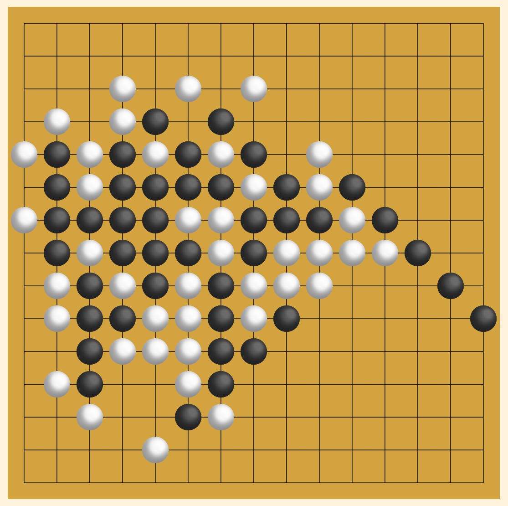

## Omok-Game (Renju)

Language : [ENG](./README.md) / [KOR](./README_korean.md)

### Preview

### Introduction
This project is a concave game produced using the React library.

Now enjoy Omok on your smartphone, tablet, or desktop. You can enjoy up to two people.

Unlike the usual concave game method, this concave game is a game with a renju rule algorithm, which alleviates the situation in which the black token becomes advantageous from the beginning.

### Features
- Responsive web-based (playable on PC, tablet, mobile environment)
- Apply Renju Rule (applies several restrictions on black token)
- Time travel function

### Info
- Title : Omok-Game (Renju-Game)
- Platform : node.js v16.20.0 | npm 8.19.4 (React Library)

### Others
This project referred to the Tik-Tae-Toe game of React Tutorial, and the rule of Renju-Rule was based on the Namu-wiki document to create an algorithm.

Renju-Rule has been implemented based on this document, but exceptions may occur in some cases.

If you have any questions about bugs or improvements, please leave your comments on the Issue tab.

- React Tutorial (Tic-Tae-Toe) : https://ko.legacy.reactjs.org/tutorial/tutorial.html
- Renju-Rule : https://namu.wiki/w/%EC%98%A4%EB%AA%A9/%EB%A3%B0%EC%9D%98%20%EC%A2%85%EB%A5%98
