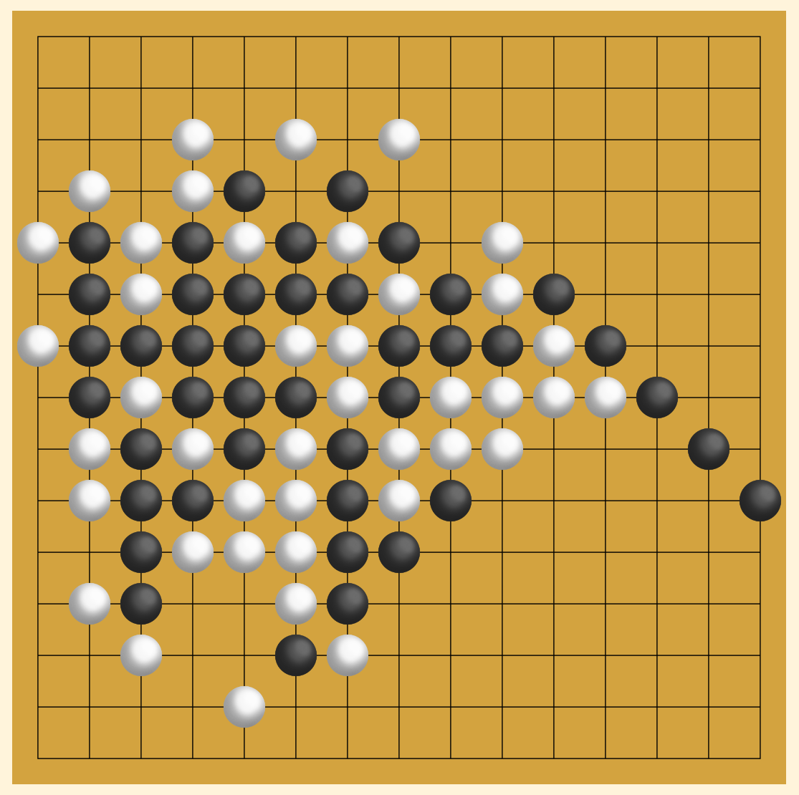

## 오목 게임 (렌주룰)

언어 : [영어](./README.md) / [한국어](./README_korean.md)


---
### 🔎 미리보기


---
### 🧑‍🤝‍🧑 소개
React 라이브러리를 이용하여 제작한 오목 게임입니다.

이제 스마트폰이나 태블릿 혹은 데스크톱으로 1인 혹은 2인끼리 오목을 즐겨보세요.

이 오목 게임은 일반적인 오목 게임 방식과는 다르게 렌주룰 알고리즘이 적용된 게임으로 흑돌이 처음부터 유리해지는 상황을 완화시켜 줍니다.

---
### 🚩 특징
- 반응형으로 제작되어 PC, 태블릿, 모바일 환경에서 플레이 가능.
- 렌주룰 적용 (혹돌에 대한 삼삼, 사사, 장목 제한 적용)
- 시간 여행 기능

---
### ℹ️ 프로젝트 정보
- Title : Omok-Game (Renju-Game)
- Platform : node.js v16.20.0 | npm 8.19.4 (React Library)

---
### 🧾 사용법
이 프로젝트를 실행하기 위해서는 기본적으로 아래와 같은 프로그램들이 필요합니다.
프로그램 이름을 클릭하면 해당 파일들을 다운로드 받으실 수 있습니다.

- [필수] [Node.js](https://nodejs.org/download/release/v16.20.1/) (v16.20.x)
- [선택] [Visual Studio Code](https://code.visualstudio.com/) (혹은 다른 편집기나 IDE를 쓰셔도 무방합니다.)

#### 설치 및 실행 방법
* 본 설치 및 실행법은 Visual Studio Code를 기반으로 작성하였습니다.
```
1. Node.js, Visual Studio Code 등 필요한 프로그램들을 다운로드합니다.  
⚠️ Node.js 버전은 반드시 v16.20.x 버전을 사용하셔야 됩니다.

2. "Omok-Game" 압축 파일을 다운로드 후 압축을 해제합니다.  
ℹ️ 현재 보고 계시는 페이지의 맨 상단의 "Code" 버튼 클릭 -> "Download ZIP" 클릭

3. Visual Studio Code를 실행합니다.

4. Visual Studio Code 상단 탭의 File -> Open Folder 클릭 후 압축을 해제했던 폴더를 선택합니다.

5. Visual Studio Code 상단 탭의 Terminal -> New Terminal을 클릭합니다.

6. 터미널에서 아래 명령어를 입력합니다.
> npm start

⚠️ 만약 "react-scripts" 에 대한 에러가 발생할 경우 아래 명령어를 먼저 실행 후 npm start를 시도해보세요.
> install react-scripts
```

---
### 📚 기타
이 프로젝트는 리액트 자습서의 틱택토 게임을 참고하였으며, 렌주룰의 규칙은 나무위키 문서를 통하여 제작하였습니다.

해당 문서를 기반으로 렌주룰을 구현하였지만 몇 가지 케이스에 대하여 예외 사항이 발생될 수 있습니다.

버그, 개선사항에 대한 문의는 Issue 탭에서 의견을 남겨주시면 감사드리겠습니다.


- React Tutorial (Tic-Tac-Toe) : https://ko.legacy.reactjs.org/tutorial/tutorial.html
- Renju-Rule : https://namu.wiki/w/%EC%98%A4%EB%AA%A9/%EB%A3%B0%EC%9D%98%20%EC%A2%85%EB%A5%98
